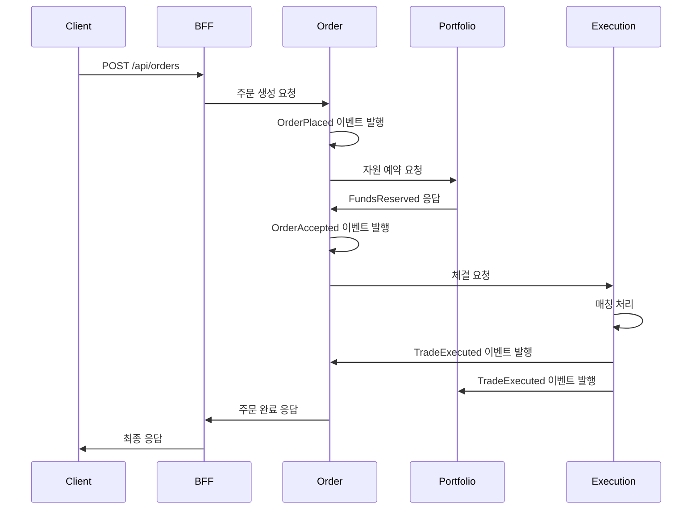

# 주식 모의매매 MSA 시스템

**이벤트 드리븐 마이크로서비스 아키텍처** 기반 주식 모의매매 시스템입니다. 실무에서 사용되는 최신 기술 스택으로 구축된 확장 가능하고 안정적인 거래 플랫폼을 제공합니다.

## 🎯 프로젝트 개요

### 핵심 기능
- ⚡ **시장가 매수/매도** 거래 지원
- 🕐 **장 시간 기반** 주문 처리 (즉시 체결 vs 예약 주문)
- 💰 **실시간 잔고 관리** 및 포지션 추적
- 📊 **대시보드** 및 주문 이력 조회
- 🔍 **종목 검색** 및 시세 조회

### 시스템 특징
- **마이크로서비스 아키텍처**: 독립적인 개발/배포/확장
- **이벤트 드리븐**: Kafka 기반 비동기 통신
- **데이터 일관성**: Outbox 패턴 + CDC 적용
- **클라우드 네이티브**: Docker + AWS 기반 배포

## 🏗️ 시스템 아키텍처

```
┌─────────────┐    ┌──────────────┐    ┌─────────────┐
│   Client    │───▶│   Nginx      │───▶│    BFF      │
│ (Frontend)  │    │ (API Gateway)│    │  Service    │
└─────────────┘    └──────────────┘    └─────────────┘
                                              │
                        ┌─────────────────────┼─────────────────────┐
                        ▼                     ▼                     ▼
                ┌─────────────┐    ┌─────────────┐    ┌─────────────┐
                │   Order     │    │ Portfolio   │    │ Execution   │
                │  Service    │    │  Service    │    │  Service    │
                └─────────────┘    └─────────────┘    └─────────────┘
                        │                     │                     │
                        └─────────────────────┼─────────────────────┘
                                              ▼
                                    ┌─────────────┐
                                    │ Market-Data │
                                    │  Service    │
                                    └─────────────┘
                                              │
                        ┌─────────────────────┼─────────────────────┐
                        ▼                     ▼                     ▼
                ┌─────────────┐    ┌─────────────┐    ┌─────────────┐
                │    Kafka    │    │ PostgreSQL  │    │    Redis    │
                │   Cluster   │    │  Database   │    │    Cache    │
                └─────────────┘    └─────────────┘    └─────────────┘
```

## 🔧 기술 스택

### 애플리케이션
- **Language**: Java 17
- **Framework**: Spring Boot 3.x
- **Build Tool**: Gradle
- **Database**: PostgreSQL 15
- **Cache**: Redis 7
- **Message Broker**: Apache Kafka

### 인프라
- **Container**: Docker + Docker Compose
- **Reverse Proxy**: Nginx
- **Cloud Platform**: AWS EC2 (t3.micro)
- **CI/CD**: GitHub Actions
- **Monitoring**: Prometheus + Grafana + Loki

### 핵심 패턴
- **Outbox Pattern**: CDC (Debezium) 기반 이벤트 발행
- **SAGA Pattern**: 코레오그래피 방식 분산 트랜잭션


## 📋 서비스 구성

| 서비스 | 포트 | 역할 | 주요 기능 |
|--------|------|------|-----------|
| **BFF** | 8080 | API Gateway | 요청 집계, 인증/인가 |
| **Order** | 8081 | 주문 관리 | 주문 접수/상태 관리 |
| **Portfolio** | 8082 | 잔고 관리 | 자산 관리, 자원 예약 |
| **Execution** | 8083 | 체결 엔진 | 매칭 엔진, 실제 체결 |
| **Market-Data** | 8084 | 시세 관리 | 종목 정보, 시세 조회 |

## 🔄 핵심 비즈니스 플로우

### 주문 생성 플로우


### 장 시간 처리 로직
- **장 시간 내 (09:00~15:30)**: 즉시 체결 시도, 미체결시 장 마감과 함께 자동 취소
- **장 시간 외**: 예약 주문으로 저장, 다음 장 개장시 활성화, 1일 후 자동 만료

## 📊 모니터링 및 관찰 가능성

### 주요 메트릭
- **비즈니스 메트릭**: 주문 생성 수, 체결 건수, 거래 금액
- **시스템 메트릭**: 응답 시간, 에러율, 리소스 사용률
- **인프라 메트릭**: CPU, 메모리, 디스크, 네트워크

### 대시보드 구성
- **시스템 전체 상태**: 모든 서비스 Health Check
- **비즈니스 KPI**: 일일 거래량, 활성 사용자 수
- **성능 모니터링**: API 응답 시간, 처리량 추이

### 로그 관리
- **중앙 집중식**: Loki 기반 로그 수집
- **구조화된 로그**: JSON 형태로 검색 및 분석 최적화
- **추적 가능성**: 요청별 추적 ID를 통한 전체 플로우 추적

## 🚀 배포

### CI/CD 파이프라인
```yaml
# GitHub Actions 워크플로우
Build → Test → Security Scan → Docker Build → Deploy → Health Check
```

### 배포 환경
- **Development**: 개발자 테스트 환경
- **Staging**: 통합 테스트 환경  
- **Production**: AWS EC2 t3.micro 프리티어

### 배포 전략
- **Blue-Green 배포**: 무중단 서비스 전환
- **롤백**: 5분 내 이전 버전 복구 지원
- **헬스체크**: 배포 후 자동 상태 확인


## 🛠️ 개발 가이드

### 프로젝트 구조
```
services/
├── bff-service/          # API Gateway
├── order-service/        # 주문 관리
├── portfolio-service/    # 잔고 관리
├── execution-service/    # 체결 엔진
└── market-data-service/  # 시세 관리
```

### 개발 워크플로우
1. **Feature 브랜치** 생성 (`feature/service-name/feature-name`)
2. **개발 및 테스트** 작성
3. **Pull Request** 생성
4. **코드 리뷰** 및 자동 테스트 통과
5. **Main 브랜치** 병합 및 자동 배포

### 장애 대응
- **자동 복구**: 헬스체크 실패 시 자동 재시작
- **수동 복구**: 5분 내 이전 버전 롤백 가능
- **장애 알림**: Slack/이메일을 통한 즉시 알림

### 커밋 메시지 규칙
```
type(scope): subject

예시:
feat(order): add market order validation
fix(portfolio): resolve balance calculation bug
docs(readme): update deployment guide
```

---
